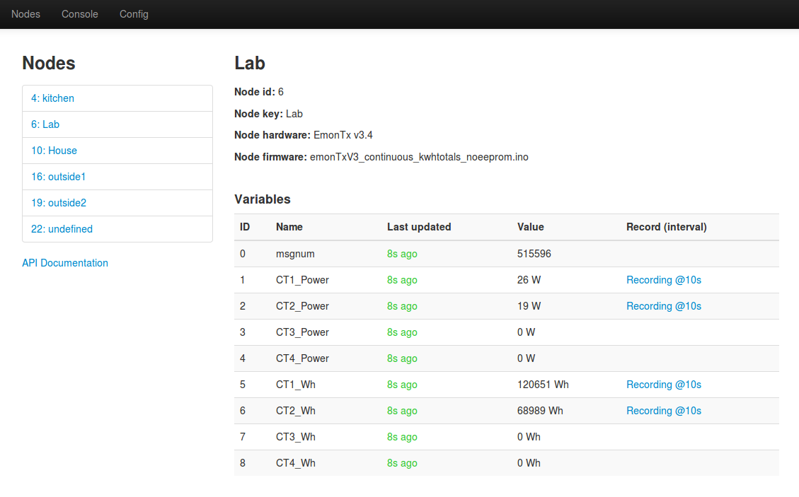
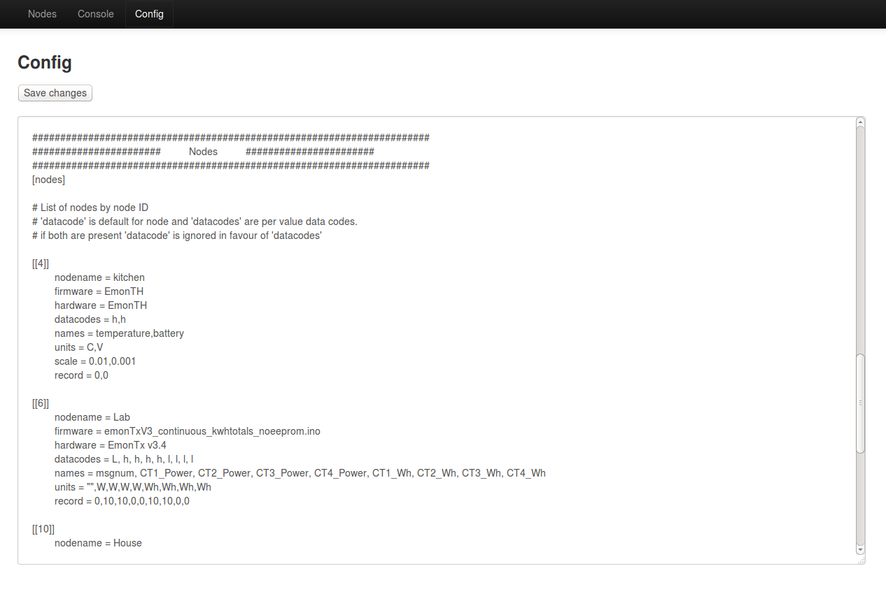

# EmonView

The nodes interface shows all the nodes received by the rfmpi and listed in emonhub.conf:

If a node:variable is being recorded it can be viewed on a graph:

The console window shows the output of emonhub.log in the browser using sockets for live scrolling.

Config is an in-browser emonhub.conf editor:

## API

[HTTP API](docs/httpapi.md)

## Install

If your starting with a blank SD card for the raspberry pi start by following this sub guide, after completing place your pi in read/write mode before continuing (rpi-rw):

[RaspberryPI Installing raspbian and setup of read-only OS and writable data partition](docs/raspbiansetup.md)

**Dependencies**

    sudo apt-get install git-core redis-server build-essential ufw ntp python-serial python-configobj mosquitto mosquitto-clients python-pip python-dev python-rpi.gpio screen sysstat minicom

Optional for firmware upload support:

    sudo pip install ino
    sudo apt-get install arduino
    
Python items:

    sudo pip install Flask
    sudo pip install Flask-SocketIO
    sudo pip install mosquitto
    sudo pip install redis

Installation of Flask-SocketIO can be slow on a raspberrypi.

**Application**

Install the version 2 branch of emonview:

    git clone -b version2 https://github.com/emoncms/emonview.git
    
Install my modification of the emonhub development branch here:

    cd /home/pi/emonview
    git clone -b development https://github.com/TrystanLea/emonhub.git

To run emonhub manually:

    cd /home/pi/emonview
    python emonhub/src/emonhub.py --config-file emonhub.conf

Install emonview service:

    sudo cp /home/pi/emonview/services/emonview /etc/init.d/
    sudo chmod 755 /etc/init.d/emonview
    sudo update-rc.d emonview defaults
    sudo chmod 755 /home/pi/emonview/server.py
    
    sudo service emonview start
    
Install feed writer service:

    sudo cp /home/pi/emonview/services/feedwriter /etc/init.d/
    sudo chmod 755 /etc/init.d/feedwriter
    sudo update-rc.d feedwriter defaults
    sudo chmod 755 /home/pi/emonview/writer.py
    
    sudo service feedwriter start
    
**Redis**

Configure redis to run without logging or data persistance.

    sudo nano /etc/redis/redis.conf

comment out redis log file

    # logfile /var/log/redis/redis-server.log

comment out all redis saving

    # save 900 1
    # save 300 10
    # save 60 10000
    
    sudo /etc/init.d/redis-server start

### Other

[Security: firewall and secure login](docs/security.md)
    
