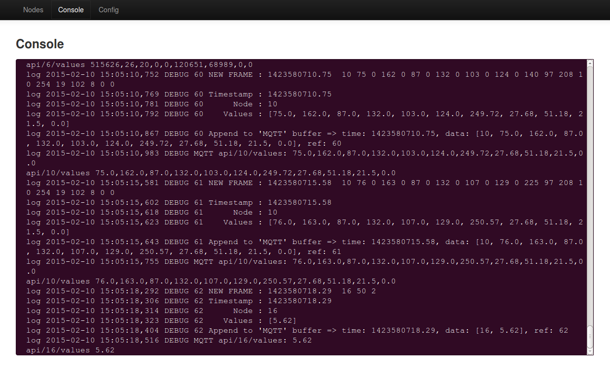

# EmonView - v2

An open source python, flask, socketio, js web application for monitoring and control

The nodes interface shows all the nodes received by the rfmpi and listed in emonhub.conf:

If a node:variable is being recorded it can be viewed on a graph:

The console window shows the output of emonhub.log in the browser using sockets for live scrolling.

Config is an in-browser emonhub.conf editor:

## Core concepts

EmonView initially aims to replace the buffered write version of emoncms on the raspberrypi, integrating much more closely with emonhub and the nature of the rfm12/69 node packet structure as well as providing features to make it easier to configure and debug a raspberrypi OpenEnergyMonitor basestation such as the console view and in browser emonhub.conf editor.

**conf files for persistent configuration rather than mysql**
In the existing emonhub + emoncms installation configuration settings of nodes are partly placed in emonhub.conf and partly in the input and feeds mysql tables in emoncms. EmonView simplifies by using emonhub.conf to take the role of the persistent 'database' that mysql was being used for. Redis (in memory with persistence turned off) is then used for the properties that change regularly such as node variable values and time to ensure we minimize writes to disk.

**Removal of input processing**
EmonView explores doing away with the separation of inputs and feeds, instead we only have nodes and node variables, which can be place holders only or can be recorded if historic data is needed.

Input processing was originally developed for doing the processing required to create kWh/d feeds. But with a shift towards calculating total watt hour accumulated on the monitoring hardware and just recording ever increasing cumulative watt hour feeds and calculating kwh/d from these feeds as a post process the power_to_kwh/d processor is no longer needed.

Scale by a value has been another often used input processor but we can move this step to the emonhub decoder which also improves and brings emonhub closer to its goal of a universal bridge between many different services.

Rather then have the hassle of having to setup inputs, input processing and feeds, and the complication of two tables with the same input and feed names etc, the node:variable only approach explored here merges them together providing just one UI where you can access historic data if recorded or just view the node:variable last values if not recorded.

For other input processors like the histogram or average process it would be better to move these to post-processing both from a usability and from a disk write perspective. With a well implemented post processing module histograms could be generated as part of a batch process initiated by the user after the data its based on is recorded. This would allow for changing the histogram resolution and recalculating. A post process is also much more disk write efficient as it can read through the input data and write the histogram data in large blocks instead of millions of individual writes.

The main disadvantage of removing input processing and the closely tied rfm12/69 node:var concept is that it does not allow for adding and subtracting inputs. A lot of the subtracting and adding could still be done in post processing but there may be situations cases that this approach cant cater for.

## Todo

Copied from v1

    name? is there a better name than emonview
    show/hide graph (graph is now on separate window)
    ~~zoom/pan graph~~ 
    graph statistics
    wh elapsed processor
    ~~full http rest api~~ almost
    ~~record button~~ record is integrated in emonhub config
    ~~last updated value~~
    ~~emonhub integration~~ almost
    service based dispatchers listening on mqtt?
    complete concept apps:
        my electric
        heating controller
    mobile/tablet/responsive views

Recently implemented

    modular javascript client implementation
    comprehensive HTTP api for nodes

## API

[HTTP API](docs/httpapi.md)

## Install

If your starting with a blank SD card for the raspberry pi start by following this sub guide, after completing place your pi in read/write mode before continuing (rpi-rw):

[RaspberryPI Installing raspbian and setup of read-only OS and writeable data partition](docs/raspbiansetup.md)

**Dependencies**

    sudo apt-get install git-core redis-server build-essential ufw ntp python-serial python-configobj mosquitto mosquitto-clients python-pip python-dev python-rpi.gpio screen sysstat minicom

Optional for firmware upload support:

    sudo pip install ino
    sudo apt-get install arduino
    
Python items:

    sudo pip install Flask
    sudo pip install Flask-SocketIO
    sudo pip install mosquitto
    sudo pip install redis

Installation of Flask-SocketIO can be slow on a raspberrypi.

**Application**

Install the version 2 branch of emonview:

    git clone -b version2 https://github.com/emoncms/emonview.git
    
Install my modification of the emonhub development branch here:

    cd /home/pi/emonview
    git clone -b development https://github.com/TrystanLea/emonhub.git

To run emonhub manually:

    cd /home/pi/emonview
    python emonhub/src/emonhub.py --config-file emonhub.conf

Install emonview service:

    sudo cp /home/pi/emonview/services/emonview /etc/init.d/
    sudo chmod 755 /etc/init.d/emonview
    sudo update-rc.d emonview defaults
    sudo chmod 755 /home/pi/emonview/server.py
    
    sudo service emonview start
    
Install feed writer service:

    sudo cp /home/pi/emonview/services/feedwriter /etc/init.d/
    sudo chmod 755 /etc/init.d/feedwriter
    sudo update-rc.d feedwriter defaults
    sudo chmod 755 /home/pi/emonview/writer.py
    
    sudo service feedwriter start
    
**Redis**

Configure redis to run without logging or data persistence.

    sudo nano /etc/redis/redis.conf

comment out redis log file

    # logfile /var/log/redis/redis-server.log

comment out all redis saving

    # save 900 1
    # save 300 10
    # save 60 10000
    
    sudo /etc/init.d/redis-server start

### Other

[Security: firewall and secure login](docs/security.md)
    
